### 1. Kotlin phân biệt 2 loại collection:
 - Mutable collection: có thể thay đổi được
 - Immutable collection: không thể thay đổi được. 

=> Các collection có thể được tạo bằng cách sử dụng các hàm tiện ích của thư viện chuẩn Kotlin, hoặc các hàm mở rộng của thư viện chuẩn Kotlin.

### 2. Mô hình lớp kế thừa của các collection trong Kotlin:
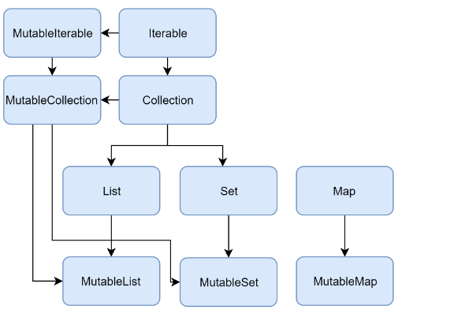
### 3. Các collection interfaces trong Kotlin:
3.1 Mutable collection
- là tập hợp các lớp dùng để lưu trữ danh sách dữ liệu và có thể thay đổi kích thước được.

3.2 Immutable collection
- là tập hợp các lớp dùng để lưu trữ danh sách dữ liệu và không thể thay đổi kích thước được.
### 4. Collection
- Collection<T> là interface cha của hệ thống phân cấp collection.Interface này đại diện cho hành vi phổ biến của một collection chỉ đọc: truy xuất kích thước, kiểm tra tư cách thành viên của mục, v.v. Collection kế thừa từ interface Iterable<T>, interface này xác định các phép toán lặp qua các phần tử. Bạn có thể sử dụng Collection làm tham số của một hàm áp dụng cho các loại collection khác nhau. Đối với các trường hợp cụ thể hơn, hãy sử dụng các inheritors của Collection: List và Set.
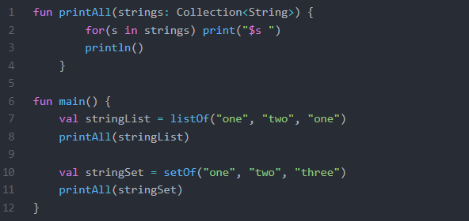
- MutableCollection là một  Collection với các phép toán ghi, như là cộng và trừ.
  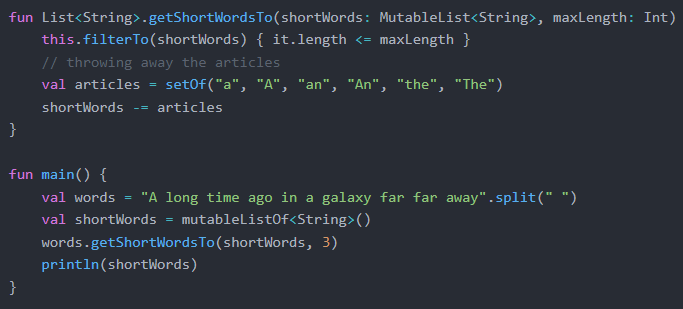

### 5. List
- List<T> lưu trữ các phần tử theo một thứ tự cụ thể và cung cấp quyền truy cập được lập chỉ mục vào chúng. Các chỉ số bắt đầu từ số 0- chỉ số của phần tử đầu tiên – và chuyển đến lastIndex là (list.size – 1).
- List là một collection chỉ có nhiệm vụ read-Only, dùng để hiển thị thông tin. Nó sẽ tối ưu bộ nhớ hơn so với Mutable List.
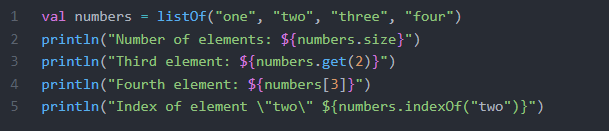
- Các phần tử trong danh sách (bao gồm cả null) có thể trùng lặp: một danh sách có thể chứa bất kỳ số lượng đối tượng bằng nhau hoặc số lần xuất hiện của một đối tượng. Hai list được coi là bằng nhau nếu chúng có cùng kích thước và các phần tử bằng nhau về cấu trúc ở cùng vị trí.
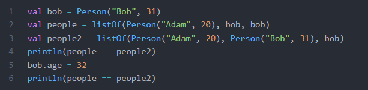
- MutableList<T> là một List với các phép tính ghi danh sách cụ thể, ví dụ, thêm hoặc bớt một phần tử tại một vị trí cụ thể.
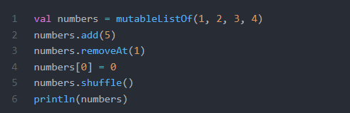

=> Trong Kotlin, triển khai mặc định của List là ArrayList, bạn có thể coi nó như là một mảng có thể biến đổi kịch thước.
### 6. Set
- Set<T> lưu trữ các phần tử duy nhất; thứ tự của chúng nói chung là không xác định. Phần tử null cũng là duy nhất: một Set chỉ có thể chứa một null. Hai set bằng nhau nếu chúng có cùng kích thước và đối với mỗi phần tử của set  có một phần tử bằng nhau trong set  kia.

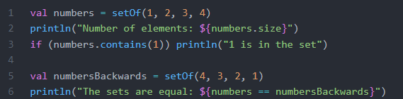
- MutableSet<T> là một Set với các phép tính ghi, ví dụ, thêm hoặc bớt một phần tử.
- Triển khai mặc định của Set- LinkedHashSet– bảo toàn thứ tự chèn các phần tử. Do đó, các hàm dựa vào thứ tự, chẳng hạn như first()hoặc last(), trả về kết quả có thể dự đoán được trên các set như vậy.

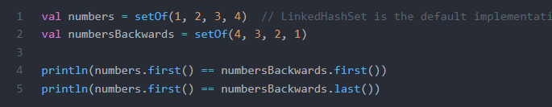

### 7. Map
- Map<K, V> lưu trữ các phần tử key-value. Các key là duy nhất, nhưng các value có thể trùng lặp. Các key và value có thể là bất kỳ kiểu nào. Các key không thể null, nhưng các value có thể null. Các map có thể có các phần tử trùng lặp: hai map được coi là bằng nhau nếu chúng có cùng kích thước và các phần tử bằng nhau về cấu trúc ở cùng vị trí.
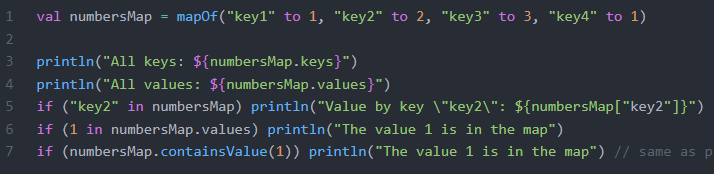
- Hai map chứa các cặp bằng nhau thì được gọi là hai map bằng nhau bất kể thứ tự cặp.
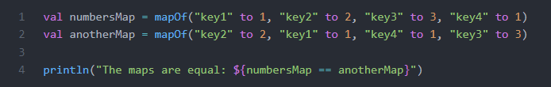
- MutableMap<K, V> là một Map với các phép tính ghi, ví dụ, thêm hoặc bớt một phần tử.
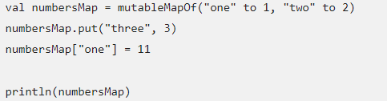
